# Miniscope Processing Pipeline Guide

## Overview
This guide walks through the complete miniscope calcium imaging processing pipeline, with in-depth parameter explanations and annotated reference plots at every tunable step.

---

## Quick Start

1. **Initial Setup**
   - **Windows**: Double-click the **MPS** icon or run `launcher.bat`
   - **Mac**: Run the `launcher.command` file
   - **Logs**: Every run automatically saves a detailed log file in the `logs` folder inside the MPS directory (the same folder where the launcher files live).

2. **Loading Data**
   - **New Analysis**: Start with Step 1: Project Configuration
   - **Existing Analysis**:
     - File → Load parameters file (if you have saved parameters)
     - Data → Load previous data (to continue from a checkpoint)
     - Enable automation → Automation → Toggle automation
     - Run automation → Run all steps or Run from current step

---

## Table of Contents

- [Getting Started](#getting-started)
- [Pipeline Steps](#pipeline-steps)
  - [Step 1: Project Configuration](#step-1-project-configuration)
  - [Step 2: Data Preprocessing](#step-2-data-preprocessing)
    - [Step 2a: File Pattern Recognition](#step-2a-file-pattern-recognition)
    - [Step 2b: Background Removal and Denoising](#step-2b-background-removal-and-denoising)
    - [Step 2c: Motion Correction](#step-2c-motion-correction)
    - [Step 2d: Quality Control](#step-2d-quality-control)
    - [Step 2e: Data Validation](#step-2e-data-validation)
    - [Step 2f: Preview Results](#step-2f-preview-results)
  - [Step 3: Spatial Cropping and Initialization](#step-3-spatial-cropping-and-initialization)
    - [Step 3a: Define ROI](#step-3a-define-roi)
    - [Step 3b: NNDSVD Initialization](#step-3b-nndsvd-initialization)
    - [Step 3c: Early Analysis Option](#step-3c-early-analysis-option)
  - [Step 4: Component Detection](#step-4-component-detection)
    - [Step 4a: Watershed Parameter Search](#step-4a-watershed-parameter-search)
    - [Step 4b: Apply Best Parameters](#step-4b-apply-best-parameters)
    - [Step 4c: Merging Units](#step-4c-merging-units)
    - [Step 4d: Temporal Signal Extraction](#step-4d-temporal-signal-extraction)
    - [Step 4e: AC Initialization](#step-4e-ac-initialization)
    - [Step 4f: Final Component Preparation](#step-4f-final-component-preparation)
    - [Step 4g: Temporal Merging](#step-4g-temporal-merging)
  - [Step 5: CNMF Preparation](#step-5-cnmf-preparation)
    - [Step 5a: Noise Estimation](#step-5a-noise-estimation)
    - [Step 5b: Validation and Setup](#step-5b-validation-and-setup)
  - [Step 6: CNMF Processing](#step-6-cnmf-processing)
    - [Step 6a: YrA Computation](#step-6a-yra-computation)
    - [Step 6b: YrA Validation](#step-6b-yra-validation)
    - [Step 6c: Parameter Suggestion for Temporal Update](#step-6c-parameter-suggestion-for-temporal-update)
    - [Step 6d: Update Temporal Components](#step-6d-update-temporal-components)
    - [Step 6e: Filter and Validate](#step-6e-filter-and-validate)
  - [Step 7: Spatial Refinement](#step-7-spatial-refinement)
    - [Step 7a: Spatial Component Dilation](#step-7a-spatial-component-dilation)
    - [Step 7b: Component Clustering](#step-7b-component-clustering)
    - [Step 7c: Component Boundary Calculation](#step-7c-component-boundary-calculation)
    - [Step 7d: Parameter Suggestions for Spatial Update](#step-7d-parameter-suggestions-for-spatial-update)
    - [Step 7e: Spatial Update](#step-7e-spatial-update)
    - [Step 7f: Merging and Validation](#step-7f-merging-and-validation)
  - [Step 8: Final Processing and Export](#step-8-final-processing-and-export)
    - [Step 8a: YrA Computation](#step-8a-yra-computation)
    - [Step 8b: Final Temporal Update](#step-8b-final-temporal-update)
    - [Step 8c: Final Filtering and Data Export](#step-8c-final-filtering-and-data-export)
- [Parameter Tuning Philosophy](#parameter-tuning-philosophy)
- [Tips and Best Practices](#tips-and-best-practices)
- [Common Issues and Solutions](#common-issues-and-solutions)
- [Interpreting Your Results](#interpreting-your-results)
- [Advanced Features](#advanced-features)
- [Automation Features](#automation-features)
- [System Requirements](#system-requirements)

---

## Getting Started

### Step A: Initial Setup

Launch MPS using the platform-specific launcher.

- **Windows**: Double-click the **MPS** icon or run `launcher.bat`
- **Mac**: Run `launcher.command`

This will start the Miniscope Processing Suite GUI.

**Logs:** Every run automatically saves a detailed log file in the `logs` folder inside the MPS directory (the same folder where the launcher files live). If a step crashes or behaves unexpectedly, check the newest log file in this directory.

### Step B: Loading Data

- **Existing parameter file** → File → Load parameters file
- **Enable automation** → Automation → Toggle automation
- **Load previous data** → Load previous data (click the directory containing the cache_path) → mark through completed n-1 step you want to land on
- **Run automation** → Run all steps or Run from current step depending on where you are

---

## Pipeline Steps

---

### Step 1: Project Configuration

> **No parameter deep dive for this step.** The only configuration beyond naming is Dask, and those settings are entirely hardware-dependent — there is no universal "correct" value. Set workers and memory limits based on your machine before proceeding. When in doubt, the defaults (8 workers, 200 GB memory limit) are conservative enough for most workstations.

**Required inputs:**
- Animal ID
- Session ID
- Input directory (directory where videos are)
- Output directory (where you want the results to go)

**Advanced Settings:** Configure Dask based on your machine setup. Default settings:
- 8 workers
- 200 GB memory limit
- 100% video percentage (decrease for testing)

> **Note:** Animal ID currently only accepts numeric values due to how naming conventions propagate through the pipeline. This is a known limitation and may be addressed in a future update.

---

### Step 2: Data Preprocessing

---

#### Step 2a: File Pattern Recognition

**File pattern**: Use regex to match your video files. For files ending in `.avi`, the default pattern is already set. Use [regex101.com](https://regex101.com) to build and test patterns interactively — paste a sample file path and iterate until you have a match.

**Options:**
- Don't worry about downsampling if your computer has sufficient resources
- Line splitting detection is optional (see [Advanced Features](#advanced-features))

---

#### Step 2b: Background Removal and Denoising

This step cleans up your raw video data. There are two independent decisions: which **denoising method** to use, and which **background removal method** to use. The plots below illustrate both on simulated miniscope data.

##### Denoising Methods

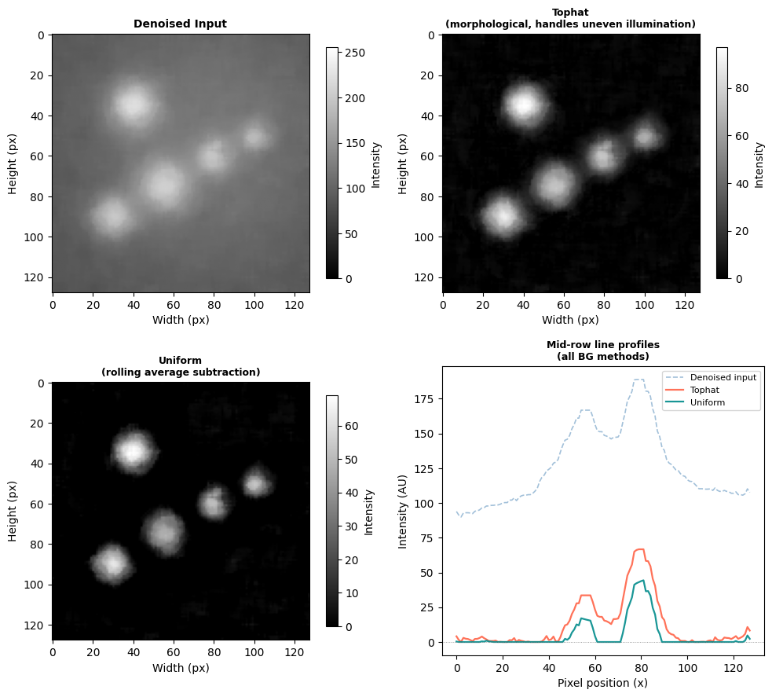

**How to read this figure:** Each panel shows the same synthetic frame (neuropil gradient + 5 neuron blobs + salt-and-pepper noise) processed with a different denoising filter. The bottom-right panel overlays mid-row line profiles from all methods. A good denoising method should track the original signal closely while suppressing the spiky noise artefacts — methods that dip into or broaden the neuron peaks are over-smoothing.

- **[0,0] Original** — The raw frame before any denoising. The slow background gradient, discrete neuron blobs, and salt-and-pepper spikes are all visible.
- **[0,1] Median (kernel=7)** — Takes the middle value in a 7×7 pixel neighbourhood. Kills salt-and-pepper spikes very effectively while preserving neuron edges sharply. The general-purpose first choice for miniscope data.
- **[1,0] Gaussian (σ=2)** — Applies a uniform Gaussian blur. Smooths noise but softens neuron boundaries and reduces peak amplitudes slightly — visible in the line profiles as shallower, broader peaks. Use when you need globally smooth output.
- **[1,1] Bilateral (d=7)** — An edge-preserving blur that refuses to smooth across sharp intensity boundaries. Neurons stay crisp while the interior of flat regions gets smoothed. Slower than Gaussian but retains more spatial structure.
- **[2,0] Anisotropic (Perona-Malik, 10 iterations)** — Directional diffusion that follows the shape of structures. Well-suited for elongated neuronal processes. Slowest option; overkill for most miniscope datasets.
- **[2,1] Line profiles** — All methods overlaid. Notice that Gaussian slightly reduces peak heights — the blur is eating signal amplitude. Median and bilateral hug the original peaks while flattening the spikes.

---

##### Background Removal Methods

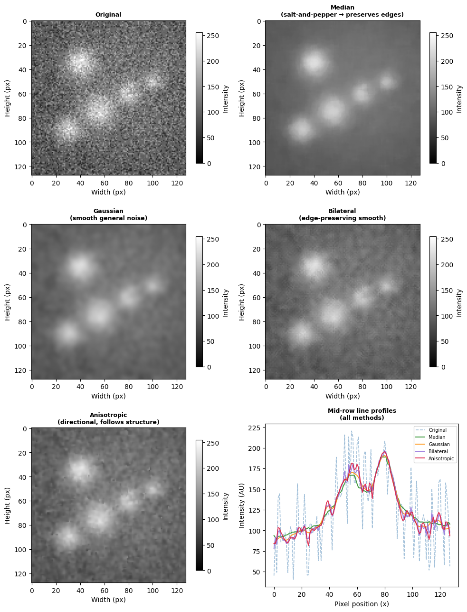

**How to read this figure:** These methods are applied after denoising (here, after Median). The goal is to subtract the slow neuropil/illumination gradient so that the baseline between neurons sits near zero. The bottom-right panel shows mid-row profiles before and after each method — a flat near-zero baseline between peaks is what you are aiming for.

- **[0,0] Denoised Input** — The median-filtered frame. The slow background gradient is still visible as a bright region in the upper-right.
- **[0,1] Tophat (disk r=15)** — Morphological white tophat: subtracts a morphologically opened version of the image. Robust to complex, non-uniform illumination gradients. Neurons pop out against a near-zero baseline. This is the recommended default for most miniscope recordings.
- **[1,0] Uniform (window=30)** — Rolling average subtraction. Faster than tophat but assumes the background changes gradually and uniformly. If your illumination gradient has sharp spatial features, some residual background will remain after subtraction.
- **[1,1] Line profiles** — The dashed blue line (denoised input) shows the baseline still elevated between neuron peaks. After either background removal method, the baseline between peaks should collapse toward zero. If you still see a sloped or elevated baseline after tophat, try increasing the disk radius; for uniform, increase the window size.

---

#### Step 2c: Motion Correction

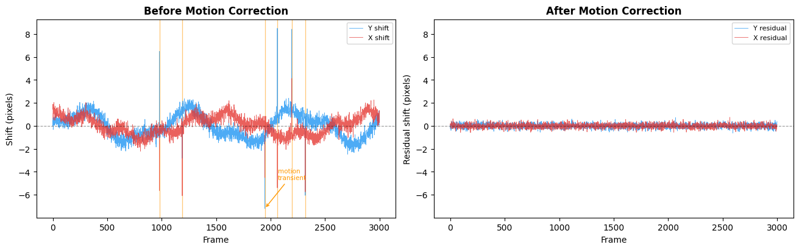

**How to read this figure:** The left panel shows the raw estimated inter-frame motion in X (red) and Y (blue) before correction is applied. The right panel shows the residual motion after correction, plotted on the same y-axis scale for honest comparison. The vertical orange lines in the left panel mark transient motion events (head movements).

**What the left panel tells you:**
- The slow sinusoidal drift reflects low-frequency biological motion — breathing and cardiac oscillation mechanically displacing the implant. The amplitude and frequency of this drift are a measure of how stable your animal's implant is.
- Sharp transient spikes are abrupt head movements or startle events. Large spikes here are candidates for frame dropping in Step 2d.

**What the right panel should look like:**
- After motion correction the residual shifts should collapse to low-amplitude noise hovering around zero. If significant drift or transient spikes persist in the right panel, the rigid correction did not fully compensate — consider whether non-rigid correction (mesh option in Step 2c) or more aggressive frame dropping (Step 2d) is warranted.

**Parameters:**
- Keep motion estimation on "frame" (default)
- Expect RAM usage up to 3× your raw video size during this step — it is one of the memory-intensive steps in the pipeline
- The algorithm uses recursive estimation with phase correlation
- For datasets with significant non-rigid motion, enable mesh-based correction by specifying a mesh size (e.g., (5,5) for a 5×5 control point grid)

---

#### Step 2d: Quality Control

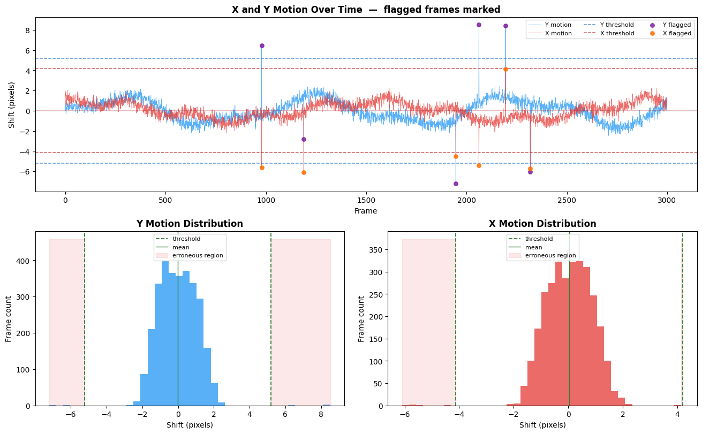

**How to read this figure:** This is what MPS displays after running Step 2d.

- **Top panel** — X (red) and Y (blue) estimated motion traces over the full recording. Dashed threshold lines show the mean ± (threshold_factor × SD) band for each axis. Frames exceeding either band in either axis are flagged as erroneous and marked with scatter points (purple for Y, orange for X).
- **Bottom-left** — Y motion histogram. The red-shaded tails are the flagged region. A narrow central peak with sparse tails is ideal. A broad, flat distribution suggests persistent motion throughout the recording that simple thresholding may not adequately address.
- **Bottom-right** — X motion histogram, same logic.

**Parameters:**
- **Threshold factor** — How many standard deviations a frame's motion must exceed the mean before it is flagged for removal. Higher values are more permissive and keep more frames; lower values are stricter and drop more. If quiet frames are being flagged (false positives), raise the factor. If obvious motion events are slipping through, lower it. The default of 5 is appropriate for most recordings.

---

#### Step 2e: Data Validation

> **No parameter deep dive for this step.** This is a validation checkpoint. The settings (fill NaN values with zero, keep other options checked) are appropriate for virtually all datasets and do not require adjustment. Its purpose is to catch data integrity issues before the pipeline proceeds — if it raises warnings, inspect the log file before continuing.

- Keep fill value as zero (for NaNs)
- Keep all other options checked
- Validates the integrity of the motion-corrected output

---

#### Step 2f: Preview Results

A lightweight data preview — a subset of validation statistics are computed and displayed but nothing is saved. Use this as a gut-check that Step 2 produced clean output before committing to the crop and initialization steps.

---

### Step 3: Spatial Cropping and Initialization

---

#### Step 3a: Define ROI

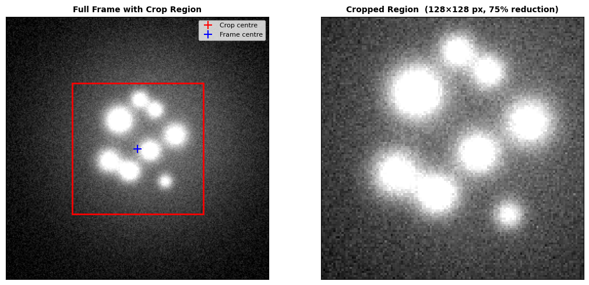

**How to read this figure:** The left panel shows the full mean-activity frame (average pixel brightness across all frames — useful as a reference for imaging field structure). The red rectangle is the proposed crop region; the red crosshair marks the crop centre and the blue crosshair marks the raw frame centre. The right panel shows what the cropped region looks like in isolation.

**The image displayed during cropping is the mean pixel brightness across all frames.** This is the most stable reference image for judging where your neurons are and how to position the crop.

**Parameters:**
- **Critical for performance**: Get the crop as small as possible while keeping all your neurons inside it. Every pixel outside the crop is pure computation saved.
- Use a circular crop centred on your imaging field
- Adjust the offset if your field of view is not centred in the frame
- **Tip**: Test on 10% of video or less during setup, then re-run the full pipeline once you have a crop size you are happy with

> If you need a static 2D image of the cropped field of view for presentations or quick checks, you can export one from the Zarr output using a short Python snippet — load the array and save the mean frame as a JPEG.

---

#### Step 3b: NNDSVD Initialization

Think of NNDSVD like a conductor listening to a recording of an orchestra warming up. Instead of trying to pick out each instrument one by one, the conductor listens to the whole cacophony and instantly recognizes "that's the violin section over there, the brass in the back, the woodwinds on the right." NNDSVD does the same — it listens to all your neural "instruments" playing at once and quickly identifies the major sections before fine-tuning each individual player.

**What NNDSVD is actually doing:** It performs a Non-Negative Double Singular Value Decomposition — a fast matrix factorization that decomposes your entire video into a compact set of spatial components. Unlike PCA, which can take a very long time on large datasets, SVD reaches a near-equivalent answer much faster by expressing the data as a product of three simpler matrices. The NN ("non-negative") constraint adds the biological prior that fluorescence signals cannot be negative, and encourages spatially compact, blob-like components rather than diffuse scatter.

---

##### Plot 1 — Singular Values and Variance Explained

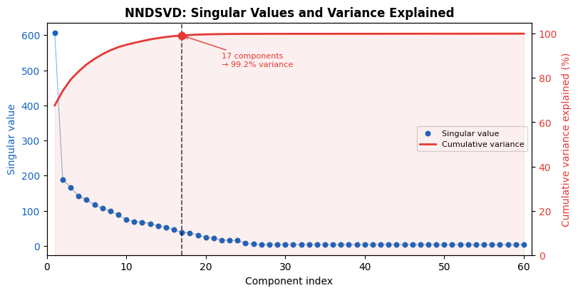

**How to read this figure:** The left y-axis (blue) shows individual singular values as scatter points — each one is roughly proportional to the "importance" of that component. The right y-axis (red) shows the cumulative percentage of total variance captured as components are added. The dashed vertical line and annotation mark the component at which 99% of total variance is explained.

**What to look for:**
- A steep early rise in the cumulative variance curve means a small number of components dominate — typical for sparse brain regions where a few neurons drive most of the signal.
- The 99% threshold is a practical stopping point. The last fraction of a percent is typically noise, not signal, and does not need to be captured.
- If you are at 95–99% explained variance with your chosen component count, your initialization is in good shape.

---

##### Plot 2 — Spatial Components Reconstruct the Full Image

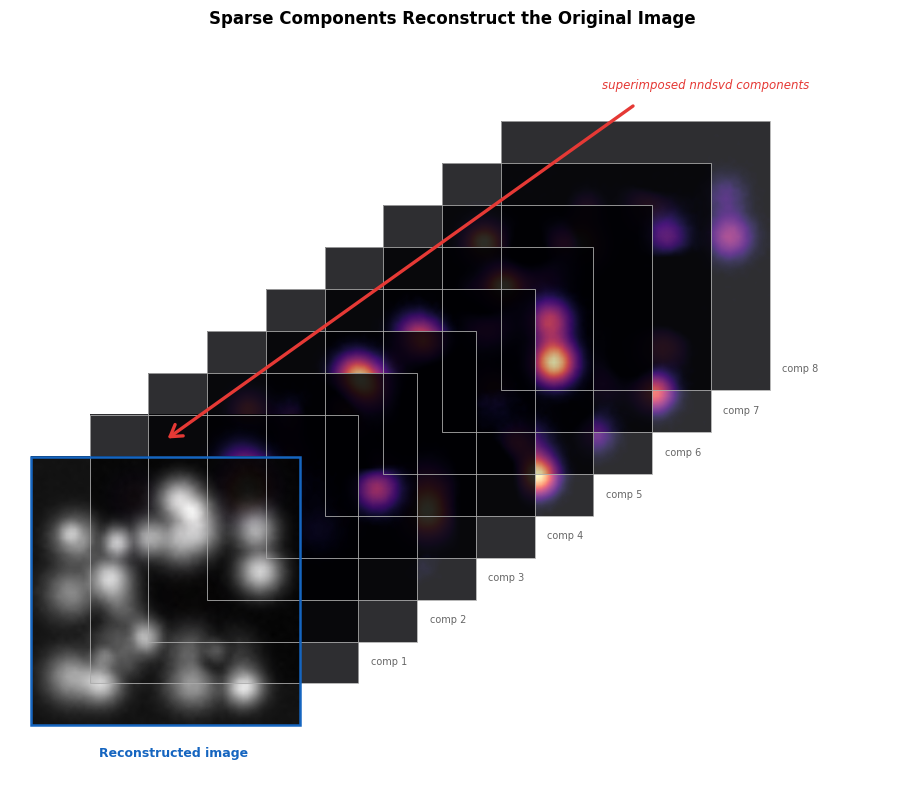

**How to read this figure:** Eight representative spatial components (components 1–8; component 0 is background) are displayed as offset image slices in pseudo-3D perspective, fanning back from the reconstructed mean frame at the front. The red arrow represents superposition: all the sparse pieces add together to recover the original image.

**What this shows:**
- Each slice captures only a small, sparse region of the field — one or a few neurons at most.
- Component 0 (not shown here) captures the dominant spatially diffuse variance, which in miniscope recordings is neuropil and background fluorescence rather than individual cells.
- Components 1 onward correspond to candidate neural signals, roughly ordered by how much variance they explain.
- Even 20–50 components will typically capture 99%+ of the variance in a sparse brain region.

---

##### Plot 3 — Reconstruction Convergence

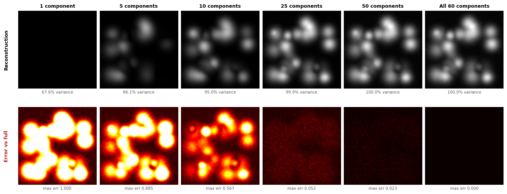

**How to read this figure:** The top row shows the field of view reconstructed from an increasing number of components (1 → 5 → 10 → 25 → 50 → all 60). The bottom row shows the per-pixel absolute error compared to the full reconstruction — bright pixels in the error map indicate regions not yet captured.

**What to look for:**
- With only 1 component, you see the dominant background gradient but individual neurons are absent.
- By ~10 components, individual neuron blobs start appearing.
- By ~25 components, the image is visually indistinguishable from the full reconstruction and the error map is near-zero everywhere.
- This is the empirical basis for the note that "99% of variance is captured within the first few components" — you can see it directly here.

**Parameters:**
- **Number of components**: Component 0 typically captures background variation. Components 1 onward are candidate neural signals. You do not need hundreds — even 20–50 will capture 99%+ of variance in a sparse region.
- **Power iterations**: Refines the SVD estimate. 5 is sufficient for virtually all datasets.
- **Sparsity threshold**: Controls signal-versus-noise selectivity (0.05 = keep things 5% above noise floor). In regions with fewer neurons and lower overall activity, consider a lower threshold to avoid discarding dim but genuine signals. In denser regions with strong average activity, a higher threshold helps exclude noise.
- **Spatial regularization**: Encourages components to be "blob-like" rather than scattered pixels. Increase for larger, more spread-out neurons; decrease for very small, compact ones.
- **Chunk size**: Decrease for lower memory usage at the cost of slower processing.

> **Important context:** The goal of NNDSVD is not perfection — it is a fast, good-enough initialization for CNMF so the algorithm does not have to search from scratch. Spending significant time tuning NNDSVD parameters provides diminishing returns. If your final CNMF results look reasonable, your initialization was good enough.

---

#### Step 3c: Early Analysis Option

> **No parameter deep dive for this step.** This is an optional early inspection point — some miniscope papers stop here if preliminary results are sufficient. Inspecting the variance-explained plot (see Plot 1 above) is the primary diagnostic. A full deep dive into NNDSVD internals is outside the scope of this guide and rarely necessary in practice.

---

### Step 4: Component Detection

---

#### Step 4a: Watershed Parameter Search

> **No parameter deep dive for this step.** This is an automated parameter sweep — MPS tests combinations of min_distance, threshold_relativity, and sigma values and scores each combination. The best result is automatically passed to Step 4b. You configure the search space (the ranges to try) rather than specific values. See Step 4b for the deep dive on what those parameters mean.

Watershed segmentation determines how many candidate neurons are detected. Since it is better to overestimate at this stage (CNMF will prune false positives downstream), this step quickly identifies the parameter combination that yields the most reasonable initial count.

**Search space parameters:**
- **Min distances**: Minimum pixel distance between neuron centres (e.g., 10, 20, 30 tries different spacings)
- **Threshold relativity**: How much brighter than surroundings a peak needs to be to count as a candidate (0.1 = 10% brighter)
- **Sigma values**: Smoothing applied before peak detection (1.0 = sharp, 2.0 = slightly blurred)
- **Sample size**: How many components to test — 20 is sufficient for most datasets

---

#### Step 4b: Apply Best Parameters

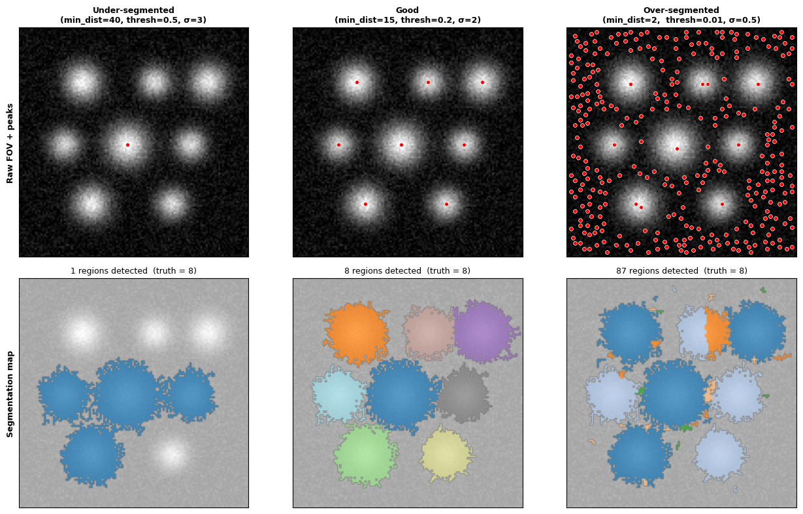

**How to read this figure:** Each column shows a different parameter regime applied to the same synthetic field of view. The top row shows the raw frame with detected peak markers (red dots). The bottom row shows the resulting coloured segmentation map overlaid on the frame. The ground truth is 8 neurons.

- **Left (under-segmented)** — min_distance too large, threshold too high. Peaks that are close together or slightly dim get missed. The algorithm "sees" only the most prominent maximum across a large neighbourhood, collapsing multiple neurons into one. Result: fewer regions than truth.
- **Centre (good)** — Well-tuned parameters. Each neuron has its own seed point and the resulting regions are approximately the right size. Note: slight over-detection here (more regions than truth) is acceptable and expected — CNMF will consolidate duplicates.
- **Right (over-segmented)** — min_distance too small, threshold too low. Every local noise fluctuation gets treated as a neuron candidate, fragmenting each real neuron into multiple small regions. Result: many more regions than truth.

**Parameters:**
- **Minimum region size**: The smallest neuron size you will accept. It is better to set this conservatively small — tiny false positives are cheaper to filter later than missed neurons are to recover.
- **Apply Filter / Apply Search known bug**: After Step 4a suggests optimal parameters, you must **deselect and then reselect** the "Apply Filter / Apply Search" option before running Step 4b. Skipping this causes the step to default to cached values from a previous run (typically min_distance=20) rather than the new suggestion. If loading from a JSON file this issue does not apply.

> **On tuning threshold relativity:** Lowering the threshold will yield more detected candidate components. Whether those additional components are genuine neurons depends heavily on your brain region and data quality. The CNMF steps downstream will filter out spurious detections, so over-seeding is not catastrophic — it just increases computation time. If you are consistently getting fewer components than expected, try a lower threshold. If you then see heavily overlapping footprints or unclear signals in the final output, that is a sign of over-seeding.

---

#### Step 4c: Merging Units

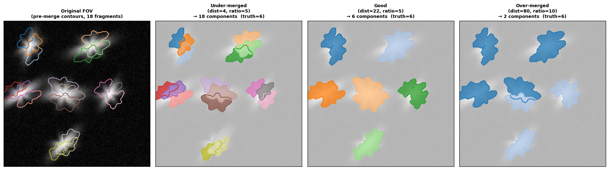

**How to read this figure:** The leftmost panel shows the original field of view with pre-merge fragment contours outlined (each colour is one fragment). The remaining three panels show post-merge results for three parameter regimes, overlaid on the same dimmed background. Ground truth is 6 neurons.

- **Panel 1 (Original FOV)** — The oversegmented starting state from Step 4b. Each true neuron has been split into 2–3 fragments, visible as distinct coloured outlines.
- **Panel 2 (Under-merged)** — Distance threshold too tight. Fragments that belong to the same neuron remain separate because they are slightly too far apart to satisfy the merge criterion.
- **Panel 3 (Good)** — Fragments of the same neuron are correctly merged back together. The result closely matches the six ground-truth neurons.
- **Panel 4 (Over-merged)** — Distance threshold too large and size ratio too permissive. Distinct neighbouring neurons get fused into single components. This is harder to recover from than under-merging.

**Parameters:**
- **Distance Threshold**: How close (in pixels) two neuron centres need to be to consider merging (25 pixels is a good starting point). Increase if fragments of the same neuron are not being merged; decrease if distinct neurons are being fused.
- **Size Ratio Threshold**: Prevents merging if one component is disproportionately larger than the other (5.0 = one can be up to 5× bigger). This protects against a small noise component being absorbed into a large neuron during an aggressive merge.
- **Minimum Component Size**: Removes anything smaller than this pixel count (9 pixels = a 3×3 square minimum). Keeps the component pool from being flooded with sub-pixel artefacts.

---

#### Step 4d: Temporal Signal Extraction

> **No parameter deep dive for this step.** This step extracts the initial calcium traces from each spatial component — moving from "here is where neurons are" to "here is what they are doing over time." The meaningful parameters are hardware configuration: batch size (components processed simultaneously), frame chunk size (frames loaded at once), and optional component limiting for test runs. Set these based on your available RAM. The 10/10000 defaults (10 components per batch, 10000 frames per chunk) are safe for most systems.

---

#### Step 4e: AC Initialization

> **No parameter deep dive for this step.** This step prepares the spatial (A) and temporal (C) matrices for the CNMF algorithm. The default spatial normalization (max — normalize each component to its brightest pixel) is appropriate for virtually all miniscope datasets. Skip Background should remain enabled (component 0 is NNDSVD background, not a neuron). This is a preparatory step and does not require parameter tuning.

---

#### Step 4f: Final Component Preparation

> **No parameter deep dive for this step.** This is a quality-control checkpoint that removes obviously broken components before the expensive CNMF processing begins — NaN components, empty components, and flat (dead pixel) components are all filtered here. The defaults (remove all three types) should always remain enabled. The seeming redundancy of Steps 4e and 4f is intentional: the initialization chain from NNDSVD through temporal signal extraction to CNMF is important enough that multiple validation checkpoints are warranted rather than risking a silent upstream failure propagating through all of CNMF.

---

#### Step 4g: Temporal Merging

##### Plot 1 — Threshold Outcomes

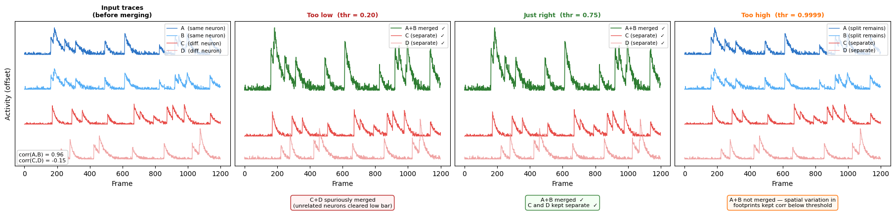

**How to read this figure:** Four panels, left to right.

- **Panel 1 (Input traces)** — All four raw components before any merging decision. Traces A and B share the same underlying calcium transients (same neuron, split into two components). Traces C and D fire independently (different neurons). Annotations show the measured pairwise correlations.
- **Panel 2 (Too low)** — Threshold set below the correlation between C and D, so unrelated neurons are spuriously merged into a single component. Information about both cells is lost.
- **Panel 3 (Just right)** — A and B are correctly identified as the same neuron and merged. C and D remain separate because their correlation falls below the threshold.
- **Panel 4 (Too high)** — The threshold is set above the observed correlation between A and B. Even though they represent the same neuron, spatial variation in the footprint boundary introduces noise into the projection, keeping the estimated correlation slightly below the true value. The split is never resolved.

##### Plot 2 — Theoretical: Threshold vs. Recording Length

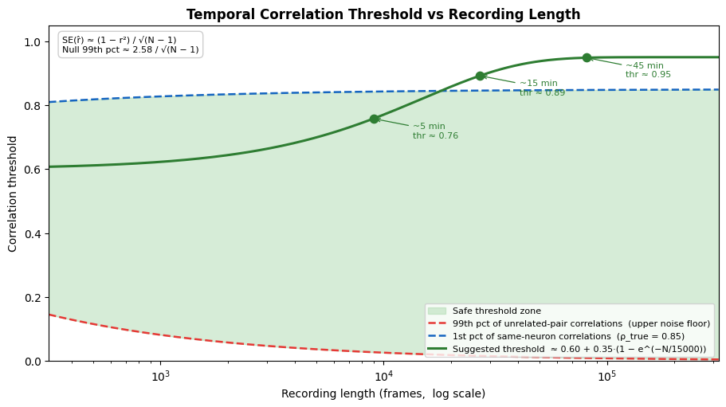

**How to read this figure:** The x-axis is recording length in frames (log scale). The two dashed lines bracket the "safe threshold zone" (green shaded area):

- **Red dashed** — 99th percentile of correlations between genuinely unrelated neuron pairs (the noise floor from chance correlation). This shrinks toward zero as the recording gets longer because longer recordings give a more accurate correlation estimate.
- **Blue dashed** — 1st percentile of correlations between genuine split pairs (ρ_true = 0.85). This rises toward ρ_true as recording length increases because the estimate converges on the true value.
- **Green line** — Suggested threshold curve: `0.60 + 0.35 × (1 − e^(−N/15000))`. For short recordings (~5 min at 10 fps), start around 0.70; for longer recordings (15–45+ min), you can safely raise the threshold to 0.85–0.90 and get cleaner separations.

**The key insight:** Longer recordings allow a higher, safer threshold because the signal-to-noise ratio of the correlation estimate itself improves with sample size.

**Parameters:**
- **Temporal Correlation Threshold**: How similar calcium traces need to be to consider merging (0.75 = 75% correlated). Scale with recording length using the figure above as a guide.
- **Spatial Overlap Threshold**: How much the two components must overlap spatially (0.3 = 30% minimum overlap). Prevents merging neurons that happen to fire together but occupy different spatial locations.

---

### Step 5: CNMF Preparation

---

#### Step 5a: Noise Estimation

The noise estimate (`sn` map) is foundational to everything CNMF does. CNMF minimizes the weighted residual `‖(Y − A·C − b·f) / sn‖²` — which means pixels with a large `sn` value (high noise) are trusted less and contribute less to the spatial footprint estimates. Getting `sn` right keeps spatial footprints tight.

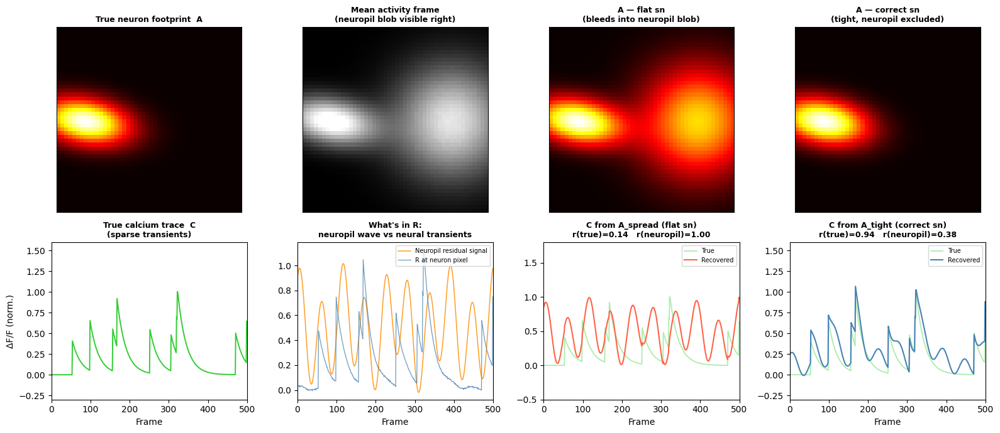

**How to read this figure:**

- **Top row** — Four spatial images: the true neuron footprint, the mean activity frame (showing the neuropil blob on the right), and two estimated footprints — one from a flat (uniform) `sn` map and one from a correctly estimated `sn` map.
- **Bottom row** — From left to right: the true calcium trace, what the residual signal looks like at a neuron pixel versus a neuropil pixel, the trace recovered using the spreading footprint, and the trace recovered using the tight footprint.

**The critical finding:** When `sn` is estimated correctly, neuropil pixels have a higher noise floor and CNMF avoids explaining their signal through the spatial footprint. When `sn` is flat (no spatial variation), those neuropil pixels appear equally reliable, and CNMF bleeds the footprint outward to capture the neuropil oscillation — which then dominates the recovered calcium trace.

- `A_spread` (flat sn): The footprint expands into the neuropil blob. The recovered trace is dominated by slow neuropil oscillation — correlation with the true calcium signal drops sharply and correlation with the neuropil waveform is high.
- `A_tight` (correct sn): The footprint stays compact and excludes the neuropil. The recovered trace closely matches the true calcium signal.

**Parameters:**
- **Noise Scaling Factor**: In active regions (where neurons are), noise is higher due to shot noise from calcium indicators. The default of 1.5 scales up the noise estimate in bright areas. If your footprints are systematically spreading into neuropil despite this correction, try increasing slightly (1.8–2.0).
- **Smoothing Sigma**: Smooths the noise map spatially to avoid pixel-to-pixel variation artifacts. 1.0 (gentle smoothing) is appropriate for most datasets.
- **Background Threshold**: Determines what counts as "active" versus "background" for the scaling calculation. `mean` (use average brightness as cutoff) is the reliable default; `median` is more robust if you have extreme outlier pixels.

---

#### Step 5b: Validation and Setup

Quality-control checkpoint before the expensive CNMF computation. Validates data integrity and optionally filters components by size.

**Parameters:**
- **Check for NaN/Inf**: Always enable — NaN values will break CNMF silently. Can be slow on very large datasets but is worth the time.
- **Compute Full Statistics**: Provides detailed component diagnostics useful for troubleshooting. Disable to save time if you are confident in your data.
- **Size Filtering**:
  - Minimum size: 10 pixels is a reasonable floor
  - Maximum size: 1000 pixels — anything larger is likely a merged neuron, a large artefact, or a blood vessel

---

### Step 6: CNMF Processing

---

#### Step 6a: YrA Computation

YrA is the raw projection of the video data onto each spatial footprint:

```
YrA[:, i] = Y @ A[i].ravel()
```

It answers: "given neuron i's spatial mask, what is the corresponding raw signal at each timepoint?" This is **not** a denoised trace — it is the raw material that Step 6d's AR/sparsity solver will denoise into C and S.

> **No parameter deep dive for this step.** The parameters here are data-handling settings: whether to subtract background (always yes), whether to use float32 (always yes — halves memory with negligible precision loss), and whether to fix NaN values (yes unless you are certain your data is clean). These do not require tuning.

##### Plot 1 — Sample YrA Traces

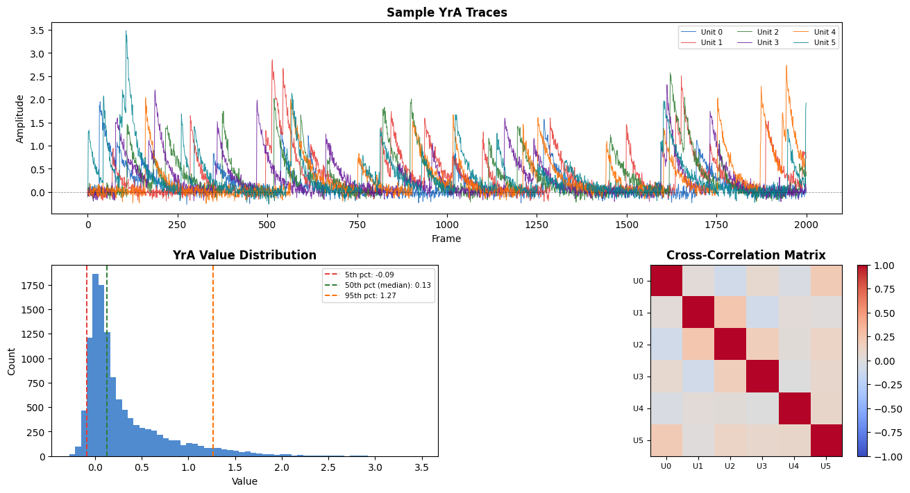

**How to read this figure:**

- **Top** — Overlaid YrA traces for multiple units. Unlike denoised C traces, these are noisy — spikes appear as bumps riding on baseline fluctuation. The baseline should hover near zero if background subtraction worked correctly. If several units track each other closely, this may indicate footprint overlap, which the spatial update in Step 7 will address.
- **Bottom-left** — Value distribution across all YrA samples. A healthy YrA distribution is right-skewed (long positive tail) because genuine calcium transients push values high while the baseline sits near zero. A symmetric distribution suggests the component may be pure noise. Negative values are expected and normal after background subtraction.
- **Bottom-right** — Cross-correlation matrix between units. After processing, YrA units should be largely independent — off-diagonal correlations near zero indicate the spatial footprints have successfully separated the sources. Strong off-diagonal values suggest unresolved footprint overlap.

##### Plot 2 — YrA Distribution Shape Diagnostics

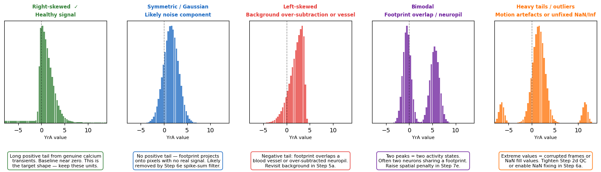

**How to read this figure:** Each panel shows a characteristic amplitude distribution shape and labels what it implies. Use these as a reference when inspecting the Step 6b validation plots.

- **Right-skewed ✓ (green)** — Long positive tail from genuine calcium transients. Baseline sits near zero. This is the target shape — keep these units.
- **Symmetric / Gaussian (blue)** — No positive tail. The footprint is projecting onto pixels with no real signal. These components will likely be removed by the Step 6e spike-sum filter.
- **Left-skewed (red)** — Negative tail present. The footprint overlaps a blood vessel or background was over-subtracted, pulling values negative. Revisit background settings in Step 5a.
- **Bimodal (purple)** — Two distinct peaks indicate two activity states — often two neurons sharing a spatial footprint. The spatial update in Step 7e should disentangle these. If it persists, raise the spatial penalty in Step 7e.
- **Heavy tails / outliers (orange)** — Extreme values in both tails indicate motion artefacts or unfixed NaN fill values. Tighten Step 2d quality control or enable NaN fixing in Step 6a.

---

#### Step 6b: YrA Validation

Sanity check on YrA computation — ensures nothing went wrong and provides quality metrics.

**Parameters:**
- **Number of Units to Analyze**: Sample size for validation (5 is sufficient to spot issues)
- **Frame Selection Method**: `random`, `start`, `middle`, `end` — any works for validation; `random` avoids being fooled by an unusually quiet or active epoch
- **Number of Frames**: 1000 is sufficient for validation statistics
- **Correlation Analysis**: Check if units are correlated after processing (they should not be)
- **Detailed Statistics**: Skewness, kurtosis, temporal stability — useful for diagnosing the distribution shape issues shown in the diagnostic plot above

---

#### Step 6c: Parameter Suggestion for Temporal Update

> **No parameter deep dive for this step.** This is an automated analysis step — MPS examines a sample of your components and suggests AR order, sparse penalty, max iterations, and zero threshold for Step 6d. Treat these suggestions as an informed starting point, not a prescription. See the Step 6d deep dive for a full explanation of what each parameter controls and how to adjust from there.

> **Note on suggested parameter variability:** Running Step 6c multiple times on the same data may produce slightly different suggested decimal values due to rounding differences between display and internal storage. This is expected and does not indicate a problem. If loading parameters from a JSON file, values are applied directly and consistently.

---

#### Step 6d: Update Temporal Components

This is the heavy lifting step — the actual CNMF temporal update. It produces the denoised calcium traces (C) and inferred spike trains (S). The three plots below cover the three most consequential parameters independently.

##### Plot 1 — sparse_penalty Effect

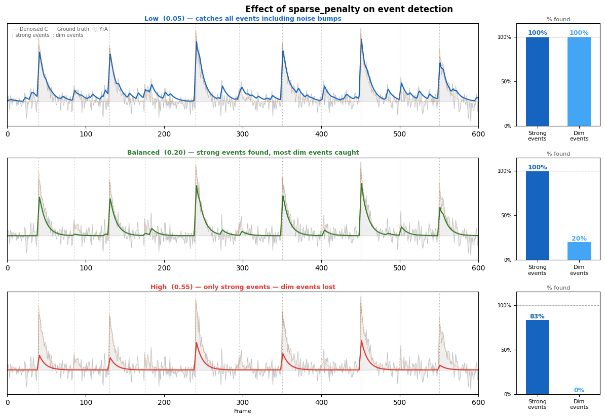

**How to read this figure:** Three rows, each with a trace panel (grey = YrA, coloured = denoised C, orange dashed = ground truth) and a bar chart showing what percentage of strong events and dim events were correctly detected.

The synthetic data contains 6 strong calcium events (large amplitude) and 5 dim events (low amplitude), with ground truth known.

- **Low penalty (0.05)** — Nearly all events detected, including dim ones. However, the trace also picks up noise bumps that do not correspond to real events. The bar chart shows high detection rates for both event classes, but false positives are present.
- **Balanced (0.20)** — Strong events are reliably detected; most dim events are caught while most noise bumps are suppressed. This is the target operating regime for most datasets.
- **High penalty (0.55)** — Only the strongest events survive. Dim events are lost entirely. The trace looks very sparse and clean but biological information is being discarded.

**The key insight:** `sparse_penalty` is a sensitivity dial. Turn it up to gain confidence that detected events are real; turn it down to catch more events at the risk of including noise. The zero threshold (Plot 3) can be used as a post-hoc confidence gate after setting a low penalty.

**Parameters:**
- **Sparse Penalty**: L1 penalty for spike sparsity. Higher = fewer detected spikes but more confident; lower = more detected spikes but more likely to include noise.

---

##### Plot 2 — AR Order Effect on Burst Resolution

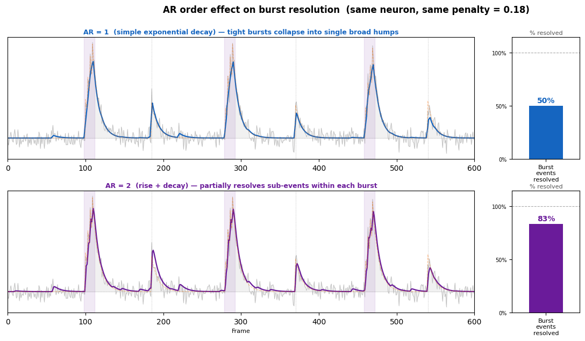

**How to read this figure:** Both rows show the same burst-heavy neuron — three tight 4-spike bursts (spikes 3 frames apart), plus isolated single events. The shaded regions mark each burst epoch.

- **AR=1 (blue)** — Assumes a simple linear exponential decay. If two spikes fire in rapid succession before the signal has returned to baseline, they are counted as a single event. Each tight burst collapses into one broad hump. The burst resolution bar shows a lower percentage of individual sub-events detected.
- **AR=2 (purple)** — Allows for more nonlinear dynamics (rise + decay). Can partially resolve closely spaced events within a burst. The resolution bar shows meaningfully higher sub-event detection.

**The practical trade-off:**
- AR=1 gives cleaner, sparser traces. For most neuroscience questions involving calcium event rates, AR=1 is sufficient and more robust.
- AR=2 is useful if you care about burst sub-structure or are working with an indicator with fast kinetics (GCaMP8f) where closely spaced events are biologically meaningful.
- AR order is conventionally an integer — stick to 1 or 2.

---

##### Plot 3 — zero_threshold as a Post-Hoc Confidence Gate

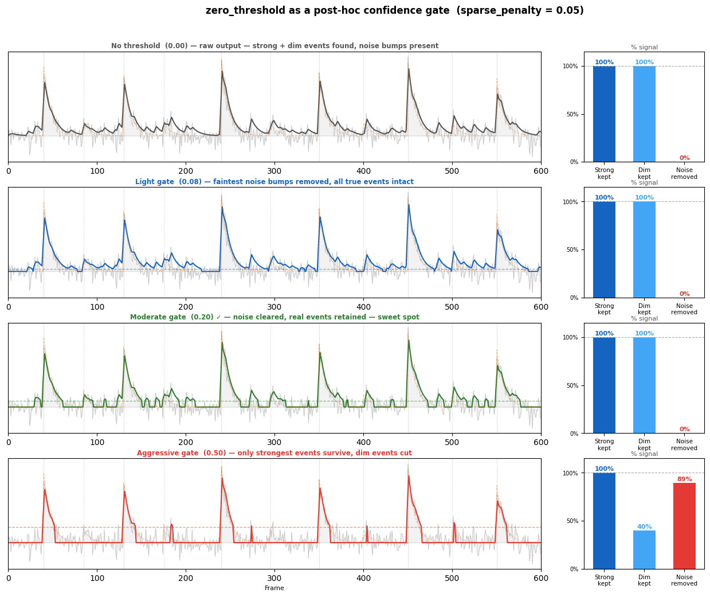

**How to read this figure:** All four rows use the same low sparse_penalty (0.05) output — meaning the raw trace has many events including some noise bumps. Each row applies an increasing zero threshold, and the bar chart shows the percentage of strong events kept (blue), dim events kept (teal), and noise bumps removed (red).

- **No threshold (0.00)** — Raw output. All events present, including noise bumps.
- **Light gate (0.08)** — The faintest noise bumps are removed. All true events — strong and dim — are intact.
- **Moderate gate (0.20) ✓** — Noise is cleared while real events are retained. This is the sweet spot for most datasets — use a low sparse penalty to catch dim events, then raise the zero threshold to suppress low-amplitude noise.
- **Aggressive gate (0.50)** — Only the strongest events survive. Dim but real events are cut, analogous to using a high sparse penalty.

**The key insight:** `sparse_penalty` and `zero_threshold` are complementary controls. Running a low penalty then applying a moderate threshold is often better than trying to find a single sparse penalty that achieves both goals — it gives you more flexibility to inspect the intermediate output before committing to a cutoff.

**Full parameter reference for Step 6d:**
- **AR Order**: 1 (simple decay, sparse traces) or 2 (complex dynamics, resolves bursts). See Plot 2.
- **Sparse Penalty**: L1 penalty controlling event detection sensitivity. See Plot 1.
- **Max Iterations**: Solver iterations — 500 is sufficient for most datasets.
- **Zero Threshold**: Post-hoc confidence gate. See Plot 3.
- **Normalize**: Always yes unless you have a specific reason not to.
- **Chunk Size**: Frames processed per parallel chunk (5000 is a safe default).
- **Overlap**: Frames shared between chunks to prevent edge artefacts (100 works well).
- **Dask Settings**: Workers, memory per worker, and threads per worker — match to your CPU and RAM configuration.

This step outputs denoised calcium traces (C), inferred spike trains (S), background components (b0/c0), and AR coefficients (g).

---

#### Step 6e: Filter and Validate

Final QC after the temporal update — removes components that did not optimize correctly.

**Parameters:**
- **Min Spike Sum**: Components with near-zero total spiking are noise (1e-6 catches truly dead components)
- **Min Calcium Variance**: Flat traces indicate dead pixels or artefacts (1e-6 is reasonable)
- **Min Spatial Sum**: Components need some spatial extent — this removes any that have become empty during optimization

Components passing all three filters are your candidate neurons proceeding to spatial refinement.

---

### Step 7: Spatial Refinement

---

#### Steps 7a–7c: Dilation, Clustering, and Bounding Boxes

These three steps prepare and organize the computation for the spatial update in Step 7e. They do not themselves change what neurons look like — they set up the computational scaffolding so that Step 7e can run efficiently.

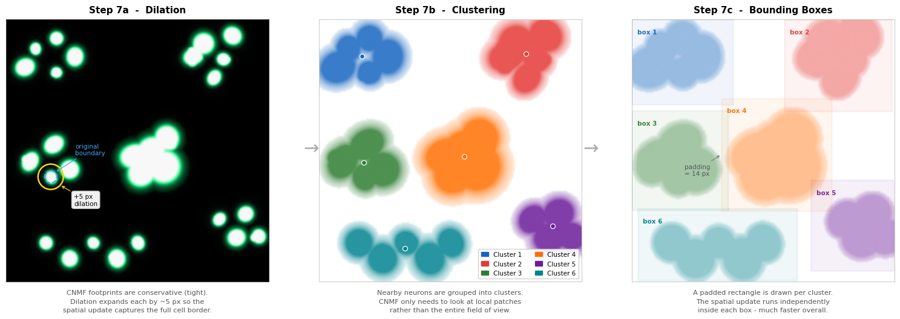

**How to read this figure:** Three panels on a shared field of view.

---

#### Step 7a: Spatial Component Dilation

**Left panel** — Shown on a black background with GCaMP-style green glow to reflect what real miniscope data looks like. The annotated neuron (mid-left cluster) shows two circles: the blue dashed circle is the original tight CNMF footprint boundary, and the yellow solid circle is the dilated boundary after Step 7a.

CNMF footprints are often conservative — they hug the brightest pixels and may not capture the full spatial extent where reliable signal exists. Dilation expands each footprint slightly so the spatial update has enough surrounding context to refine the boundary accurately.

**Parameters:**
- **Dilation Window Size**: Radius of the structuring element in pixels (3 is typical). Larger values expand more aggressively but risk causing nearby neurons to overlap.
- **Intensity Threshold**: Only dilate pixels above this fraction of the component maximum (0.1 = 10%). Prevents dilation into noise pixels at the periphery of the footprint.

---

#### Step 7b: Component Clustering

**Middle panel** — White background, with each colour representing one cluster. Centroid markers indicate the cluster centres. Nearby neurons are grouped together so the spatial update can process local patches rather than the entire field of view.

**Parameters:**
- **Max Cluster Size**: Maximum components per cluster (10 default)
- **Min Area**: Minimum area to consider a component valid for clustering (20 pixels)
- **Min Intensity**: Minimum intensity threshold (0.1 default)
- **Overlap Threshold**: How much components can overlap before clustering (0.2 = 20%)

---

#### Step 7c: Component Boundary Calculation

**Right panel** — Same clusters as the middle panel but dimmed, with coloured bounding rectangles drawn around each. The spatial update in Step 7e runs independently inside each box — this is what makes the spatial update tractable without processing the full field of view at once.

**Parameters:**
- **Dilation Radius** (10 pixels): How much to expand footprints before calculating bounds. Larger = bigger boxes, more conservative.
- **Padding** (20 pixels): Extra space added around the dilated shapes. Ensures neurons near cluster edges are fully captured.
- **Minimum Size** (40 pixels): Smallest allowed bounding box dimension.
- **Intensity Threshold** (0.05): What fraction of the component's maximum intensity counts as "part of the neuron" for bounds calculation.

---

#### Step 7d: Parameter Suggestions for Spatial Update

> **No parameter deep dive for this step.** This is an automated analysis step analogous to Step 6c — MPS examines a sample of your spatial components and temporal data to suggest min_std and penalty values for Step 7e. Treat the suggestions as an informed starting point. The Step 7e deep dive below explains what these parameters control visually so you can deviate from the suggestion if your output does not look right.

---

#### Step 7e: Spatial Update

This step runs multi-penalty LASSO regression on local video regions to update each neuron's spatial footprint. It is the most computationally expensive step in the spatial refinement pipeline and the one where parameter choices matter most for what the final footprints look like.

##### Plot 1 — min_std Effect

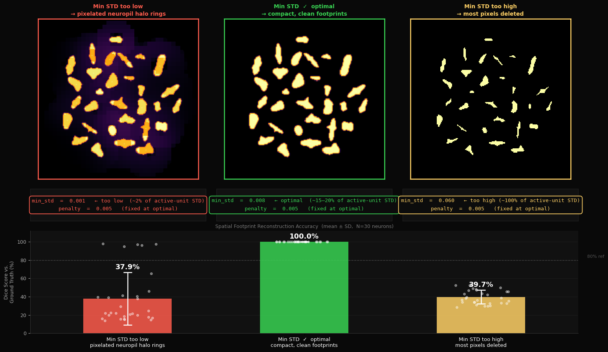

**How to read this figure:** Three columns on a dark background with inferno colormap (matching real miniscope output). Below each field is a parameter badge and a Dice score bar chart comparing each scenario's footprints to ground truth. Individual neuron Dice scores are shown as scattered white dots; error bars show ±1 SD.

- **Left (too low, red)** — min_std set far below active-unit pixel STD. Neuropil pixels are included in the regression because their signal variation is above the (too-permissive) threshold. The result is blocky, pixelated ring halos around neurons — the neuropil signal has leaked into the spatial map. Dice score drops substantially.
- **Centre (optimal, green)** — min_std set to approximately 15–20% of the active-unit pixel STD. Only pixels with genuine temporal variation above the neuropil noise floor are included. Footprints are compact and clean. Dice score is highest.
- **Right (too high, yellow)** — min_std set near or above the active-unit pixel STD. Only the very brightest core pixels survive the threshold; the majority of the footprint is discarded. The neuron appears as a tiny dot. Dice score drops because most of the true footprint is excluded.

##### Plot 2 — Penalty Effect

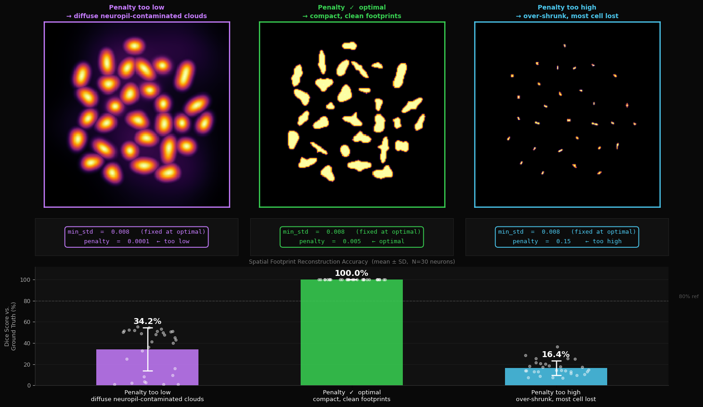

**How to read this figure:** Same format as Plot 1, with min_std fixed at optimal and penalty varying.

- **Left (too low, purple)** — LASSO penalty too small. The regression allows diffuse solutions. Each footprint bleeds outward into neuropil and neighbouring neurons, producing large, overlapping clouds. Dice score drops because the estimated footprint is much larger than the true footprint.
- **Centre (optimal, green)** — Penalty at the right level. Each footprint is compact and well-separated. Dice score is highest.
- **Right (too high, teal)** — Penalty too large. The L1 penalty pushes most coefficients to zero, leaving only a tiny bright core. The neuron is massively under-represented. Dice score drops because most of the true footprint is zeroed out.

**The combined intuition:** `min_std` is a pixel pre-filter that gates which pixels are even eligible for the regression. `penalty` is the sparsity control on the regression itself. Both work in the same direction — higher values produce more compact footprints — but they operate at different stages and can be tuned independently.

**Full parameter reference for Step 7e:**
- **Number of Frames**: Frames used for the spatial update — more frames give a better estimate of temporal variability but increase computation time.
- **Min Penalty**: Lower bound of the LASSO penalty range to search.
- **Max Penalty**: Upper bound of the penalty range.
- **Num Penalties**: Number of penalty values to try across the range.
- **Min STD**: Minimum pixel temporal STD to be included in the regression. Set to ~15–20% of the median active-unit pixel STD as a starting point.
- **Progress Interval**: How often to report progress.
- **Show incremental updates**: Display component updates as they are processed — useful for monitoring long runs.

> **On spatial footprint shape and scientific interpretation:** Using higher min_std and penalty produces more compact, tightly defined footprints. Lower values produce more expansive ones. Keep in mind that the spatial map is a reference — it tells you which pixels the signal is coming from, not necessarily the exact anatomical extent of the neuron. Neurons may be larger than their detected footprint depending on optical configuration, GCaMP expression level, and camera angle. As long as you are not making morphological claims from the spatial footprint shape, either setting is defensible. The temporal signals are where the scientific information lives.

---

#### Step 7f: Merging and Validation

Final spatial processing — merges the updated components from Step 7e, handles cluster-boundary overlaps, and produces the final spatial matrix ready for Step 8.

**Parameters:**
- **Apply smoothing**: Whether to apply Gaussian smoothing to merged components
- **Smoothing Sigma**: Gaussian filter sigma. Be cautious — over-smoothing causes footprints to bleed into large diffuse blobs that may overlap neighbouring neurons.
- **Handle overlaps**: Normalizes components at cluster-boundary overlap regions. Keep this enabled in virtually all cases — disabling it produces inconsistent boundaries where processing windows meet.
- **Min Component Size**: Minimum component size in pixels to keep after merging
- **Save both versions**: Saves both raw and smoothed versions for comparison

> **If components look blocky or rectangular after Step 7f:** This artefact comes from the bounding box geometry of Step 7c, not from smoothing. Reducing smoothing sigma will not fix it. If you see this, it is a cosmetic artefact of the tiling approach and does not affect trace quality. Step 7f is quick to re-run relative to 7e, so it is easy to experiment with smoothing settings.

---

### Step 8: Final Processing and Export

Step 8 re-runs the temporal update using the improved spatial footprints from Step 7. Because the spatial components are more accurate after refinement, the temporal traces from Step 8 are cleaner than what Step 6 produced. Since the solution is already close to converged, parameter sensitivity in Step 8 is subtler than in Step 6 — but both steps deserve careful attention.

---

#### Step 8a: YrA Computation

> **No parameter deep dive for this step.** See the Step 6a documentation for a full explanation of what YrA is and how to interpret its diagnostic plots. The same logic applies here, using the updated spatial components from Step 7f as input. The data-handling parameters (subtract background, use float32, fix NaN values) should all remain at their recommended defaults.

**Parameters:**
- **Spatial Component Source**: Use `step7f_A_merged` (the refined spatial components from Step 7f)
- **Temporal Component Source**: Which temporal components to use for the background subtraction calculation
- **Subtract Background**: Always yes
- **Use Float32**: Always yes
- **Fix NaN Values**: Yes unless you are certain your data is clean

---

#### Step 8b: Final Temporal Update

> **No parameter deep dive for this step.** See the Step 6d documentation for a full explanation of AR order, sparse penalty, zero threshold, and their interactions — the same parameter logic and the same diagnostic plots apply here. Because the spatial components are now more accurate, you may find that slightly different parameter values produce better results than what worked in Step 6 — but the direction of each parameter's effect is identical.

**Key parameters** (see Step 6d for full discussion):
- **AR Order (p)**: 1 or 2. See Plot 2 in Step 6d.
- **Sparse Penalty**: L1 penalty. See Plot 1 in Step 6d.
- **Zero Threshold**: Post-hoc confidence gate. See Plot 3 in Step 6d.
- **Chunk Size / Chunk Overlap**: Temporal chunking for memory efficiency. Smaller chunks = less RAM, more processing time.
- **Include background**: Incorporate background components (b, f) into the update.

> **On parameter consistency and cross-session comparisons:** If you use identical Step 8 parameters across all animals and sessions in your dataset, the resulting calcium traces are mathematically comparable on an absolute scale — meaning you do not necessarily need to Z-score signals before comparing them across recordings. This holds assuming stable GCaMP expression and consistent optical conditions. If conditions varied substantially across sessions, or if you tune Step 8 parameters per session, Z-scoring before comparison remains appropriate. Either approach is valid; the key is consistency within your analysis.

---

#### Step 8c: Final Filtering and Data Export

> **No parameter deep dive for this step.** See the Step 6e documentation for the filtering logic — the same criteria (min spike sum, min calcium variance, min spatial sum) apply. Export format is a practical choice based on your downstream analysis tools rather than a parameter to tune.

**Filtering Criteria:**
- **Min Component Size**: Minimum size in pixels
- **Min Signal-to-Noise Ratio**: Minimum SNR threshold
- **Min Correlation**: Minimum correlation coefficient

**Export Options:**
- **Zarr format**: Efficient for large-scale analysis with chunked out-of-memory computation
- **NumPy format**: Compatible with most Python scientific analysis pipelines
- **JSON format**: Human-readable metadata and component IDs for sharing with non-Python tools
- **Pickle format**: Complete Python objects for fast Python-to-Python transfer with all metadata preserved

The export includes a timestamp and all processing parameters, ensuring full reproducibility.

---

## Parameter Tuning Philosophy

One of the most common questions when using MPS is: how do I know which parameters to adjust, and when? Understanding the overall architecture of the pipeline helps answer this.

**Steps 1–5 are initialization.** Their job is to give CNMF a well-structured starting point. The preprocessing, denoising, motion correction, NNDSVD, and watershed steps all serve to place the algorithm close to the right answer before expensive optimization begins. A CNMF run from random initialization would take far longer to converge and might settle into a suboptimal local minimum. Because of this, over-tuning parameters in Steps 1–5 is generally not the best use of time. **Focus your tuning energy on Steps 6, 7, and 8.**

**Steps 6 and 8 are the most scientifically important.** These are where the actual temporal signals are estimated. Step 6 produces the first full CNMF solution; Step 8 refines it using the improved spatial footprints from Step 7. Both steps warrant careful parameter attention. Step 6 parameters have more leverage — changes there can produce substantially different results because the algorithm has more room to move. Step 8 is where you get the final, cleanest traces, but parameter sensitivity is subtler since the solution is already near convergence.

**Step 7 governs spatial appearance.** If you care about how the spatial footprints look — for figures, presentations, or ROI definition — tune Step 7 parameters. But recognize that for most scientific conclusions drawn from miniscope data, the spatial map is a reference, not the result. Neurons may not fully illuminate even if GCaMP is expressed there, depending on lens position, focal plane, expression level, and vasculature. The shape you see is where reliable signal is coming from, not necessarily the full anatomical extent of the cell.

**On neuron counts and sparse brain regions:** If you are recording from a region with relatively few neurons (e.g., 20–30 per session), this is likely a true reflection of your data rather than a failure of the pipeline. Adding more components to capture a marginal signal is a genuine tradeoff: every additional component must be "paid for" by subtracting from the noise and background estimates in the CNMF model. In a recording with 20 bright neurons, forcing detection of 2–3 additional dim candidates risks introducing noise into the traces of all 20 existing neurons. High-quality signals from 20 neurons can be more scientifically valuable than noisy signals from 25.

**On parameter generalizability:** Default and suggested parameters are good starting points, but they were developed with specific data in mind. Your optimal parameters will depend on your brain region, calcium indicator (GCaMP6f vs GCaMP8f have different kinetics), lens numerical aperture, recording duration, and expected neuronal density. Treat parameter suggestions as an informed first guess, and interpret the diagnostic plots at each stage as your evidence for whether to adjust.

---

## Tips and Best Practices

1. **Start small**: Test parameters on 10% of your data before running the full pipeline.
2. **Monitor memory**: The pipeline is memory-intensive, especially Steps 2c and 6a.
3. **Save frequently**: Enable autosave in the automation menu.
4. **Check intermediate results**: Use the visualization steps (2f, 6b) to verify processing quality before committing to expensive downstream steps.
5. **Adjust for your data**: Default parameters work for most data, but your specific recording may need tweaks based on your brain region, indicator, and recording setup.
6. **When in doubt, oversegment**: It is easier to merge components later than to split them.
7. **Use parameter suggestions as a starting point**: Steps 4a, 6c, and 7d analyze your specific data to recommend settings — treat these as an informed hypothesis, not a prescription. Validate by inspecting the diagnostic plots at each stage.
8. **Use temporal chunking in Steps 6d and 8b**: This dramatically reduces memory usage for long recordings.
9. **Export multiple formats**: Different downstream analyses may prefer different formats.
10. **Document your parameters**: The pipeline saves all parameters automatically for reproducibility.
11. **Inspect temporal signals, not just spatial maps**: The calcium traces are where the scientific signal lives. Spatial footprints are reference maps — do not over-interpret their exact shape.
12. **Use a consistent parameter set across sessions**: If you use the same Step 8 parameters for all recordings in an experiment, you can compare raw traces directly without Z-scoring, assuming stable imaging conditions.
13. **Check logs when debugging**: Every run automatically saves a detailed log file in the `logs` folder inside the MPS directory.

---

## Common Issues and Solutions

**Memory errors during YrA computation:**
- Reduce the number of components processed at once
- Use float32 precision (should already be on)
- Increase Dask memory limits

**Components look fragmented after spatial update:**
- Decrease penalty values in Step 7e — see the penalty effect plot
- Check if min_std threshold is too high — see the min_std effect plot
- Consider decreasing the dilation radius in Step 7a

**Too many spurious components detected:**
- Increase minimum component size thresholds
- Use conservative parameter suggestions in Step 4a
- Increase distance threshold in watershed segmentation

**Temporal traces look noisy:**
- Increase AR order from 1 to 2 — see the AR order plot in Step 6d
- Increase sparse penalty — see the sparse penalty plot in Step 6d
- Verify that noise estimation in Step 5a is accurate

**Background components missing:**
- Ensure Step 3b includes component 0
- Check that background removal in Step 2b is not too aggressive

**Step 8a YrA computation fails:**
- Check that spatial and temporal components have matching unit IDs
- Ensure all required data from previous steps is available
- Try reducing to a subset of components for testing

**CVXPY solver failures in Steps 6d or 8b:**
- Reduce max iterations if the step is taking too long
- The code tries ECOS first, then SCS — if both fail, check for components with all-zero traces (Step 6e should have caught these)

**Memory errors during Steps 6d or 8b:**
- Use temporal chunking with smaller chunk sizes
- Process components in smaller batches
- Close other applications to free RAM

**Step 4b not applying suggested parameters:**
- Deselect and reselect the "Apply Filter / Apply Search" option before running Step 4b
- Alternatively, load parameters from a JSON file to bypass this issue entirely

**Spatial components look blocky or rectangular after Step 7f:**
- This comes from the bounding box geometry of Step 7c, not from smoothing
- Reducing smoothing sigma will not fix it — it is a cosmetic tiling artefact
- Step 7f can be re-run quickly without redoing Step 7e

**YrA distributions look bimodal or left-skewed (Step 6b plots):**
- Bimodal: footprint overlap — raise spatial penalty in Step 7e
- Left-skewed: background over-subtraction or vessel contamination — revisit Step 5a noise scaling

---

## Interpreting Your Results

After completing the pipeline, you will have several key outputs.

### Spatial Components (A)
- **What they show**: The spatial footprint of each neuron — which pixels contributed reliably to the component's signal
- **What to look for**: Clear, contiguous regions roughly matching expected neuron size for your preparation
- **Red flags**: Highly fragmented components; components much larger than expected neurons; bimodal or ring-shaped footprints
- **Important caveat**: The spatial footprint shows where reliable fluorescence signal was detected, not the full anatomical extent of the neuron. Shape and size are influenced by lens focal plane, expression heterogeneity, and local vasculature. Do not make morphological conclusions from these footprints.

### Temporal Components (C)
- **What they show**: Denoised calcium traces for each neuron
- **What to look for**: Clear calcium transients with good signal-to-noise ratio; sparse events consistent with the indicator's kinetics; baseline hovering near zero
- **Red flags**: Flat traces, excessive noise, unrealistic dynamics, traces dominated by slow sinusoidal oscillation (neuropil contamination)
- **This is the primary scientific output.** Spend more time evaluating trace quality than spatial map appearance.

### Spike Estimates (S)
- **What they show**: Inferred spike times and amplitudes from the AR deconvolution
- **What to look for**: Sparse events temporally aligned with calcium transients; the magnitude of each spike event should correspond to the size of the transient
- **Red flags**: Continuous spiking (implies the sparse penalty is too low or the AR model is misspecified); no detected events in a neuron with visible transients (sparse penalty too high)

### Quality Metrics
- **Component size distribution**: Should match expected neuron sizes for your preparation
- **Signal amplitude distribution**: Should show clear separation from noise
- **Temporal correlation**: Neurons should not be perfectly correlated unless they are truly synchronized

### Using Your Results
The exported data supports: population analysis of ensemble activity patterns; single-cell analysis of individual neuron responses; behavioral correlation linking neural activity to behavior; network analysis of functional connectivity; and longitudinal studies tracking the same neurons across sessions.

Remember: the pipeline provides cleaned signals, but biological interpretation requires domain knowledge. When in doubt, return to the original videos to verify that detected components correspond to real neurons.

---

## Advanced Features

### Line Splitting Detection

Some miniscope systems experience line splitting artefacts where signal appears in the leftmost pixels of frames. The pipeline can automatically detect and remove these frames.

**When to use**: Enable in Step 2a if you notice vertical lines or artefacts on the left edge of your videos.

**Implementation:**
```python
import numpy as np

def detect_line_splitting_frames(xarray_data):
    """
    Detect line splitting frames by looking for signal in the leftmost 20 pixels.

    Args:
        xarray_data: xarray DataArray with dimensions ['frame', 'height', 'width']

    Returns:
        list: Frame indices to drop, e.g. [45, 123, 456]
    """
    left_edge = xarray_data.isel(width=slice(0, 20))
    left_edge_means = left_edge.mean(dim=['height', 'width']).compute()
    overall_mean = left_edge_means.mean().item()
    overall_std = left_edge_means.std().item()
    threshold = overall_mean + 2 * overall_std
    problematic_frames = np.where(left_edge_means > threshold)[0]
    return problematic_frames.tolist()
```

> **Note on output file behavior:** If no erroneous frames are detected, the `all_removed_frames.txt` log file will not be created. This is expected — the absence of the file indicates no frames were removed, not that something went wrong.

### Batch Processing with Parameters
The pipeline supports saving and loading parameter files for batch processing:
- **Save parameters**: After completing a successful run, save via File → Save parameters
- **Load parameters**: For new datasets, load saved parameters via File → Load parameters
- **Automation**: Enable automation to run multiple steps without intervention

### Custom Preprocessing Functions
You can add custom preprocessing functions in Step 2a by modifying the `post_process` parameter in the video loading function.

### Non-rigid Motion Correction
For datasets with significant non-rigid motion, enable mesh-based correction in Step 2c by specifying a mesh size (e.g., `(5,5)` for a 5×5 control point grid).

---

## Automation Features

### Autorun Mode
- **Toggle Autorun**: Automation → Toggle Autorun
- **Configure delays**: Automation → Configure Autorun
- **Run all steps**: Automation → Run All Steps
- **Run from current**: Automation → Run From Current Step

### Parameter Files
- Load predefined parameters to ensure consistency across analyses
- Parameters are automatically applied to each step during autorun
- Auto-save feature preserves parameters after each step

---

## System Requirements

### Minimum Requirements
- **RAM**: 32 GB (64 GB+ recommended)
- **CPU**: 8+ cores recommended
- **Storage**: SSD with 2× video size free space
- **GPU**: Not required but can accelerate some operations

### Recommended Setup
- **RAM**: 128 GB+ for large datasets
- **CPU**: 16+ cores for parallel processing
- **Storage**: NVMe SSD for fastest I/O
- **Network**: Fast connection if using network storage

---

## Final Notes

This pipeline transforms raw calcium imaging videos into clean, separated signals from individual neurons. Each step builds on the previous ones, gradually refining the separation between signal and noise, between different neurons, and between neural activity and background.

The key insight is that neural signals have both spatial structure (the shape of the neuron) and temporal structure (how the calcium concentration changes over time). By iteratively refining our estimates of both, CNMF achieves far better separation than either dimension alone could provide.

**Perfect is the enemy of good.** The goal is biologically meaningful signals, not mathematical perfection. When in doubt, preserve more components rather than fewer — you can always exclude them in downstream analysis. And when a step is misbehaving, the first thing to check is always the log file.

---

## Contributing and Support

For issues, questions, or contributions:
1. Check the troubleshooting section first
2. Review intermediate outputs to identify where the problem occurs
3. Save your parameter file and share it when reporting issues
4. Include system specifications (RAM, CPU, GPU) when reporting performance issues

Happy processing!
